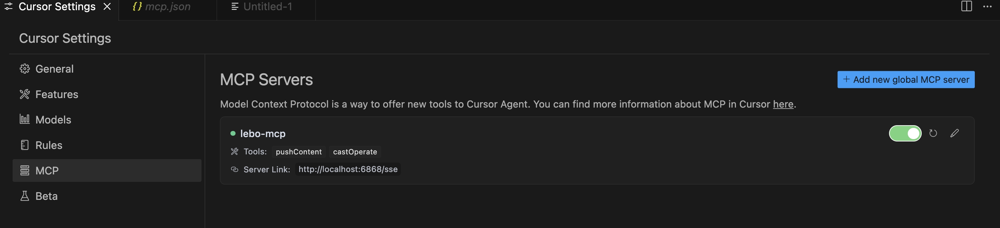
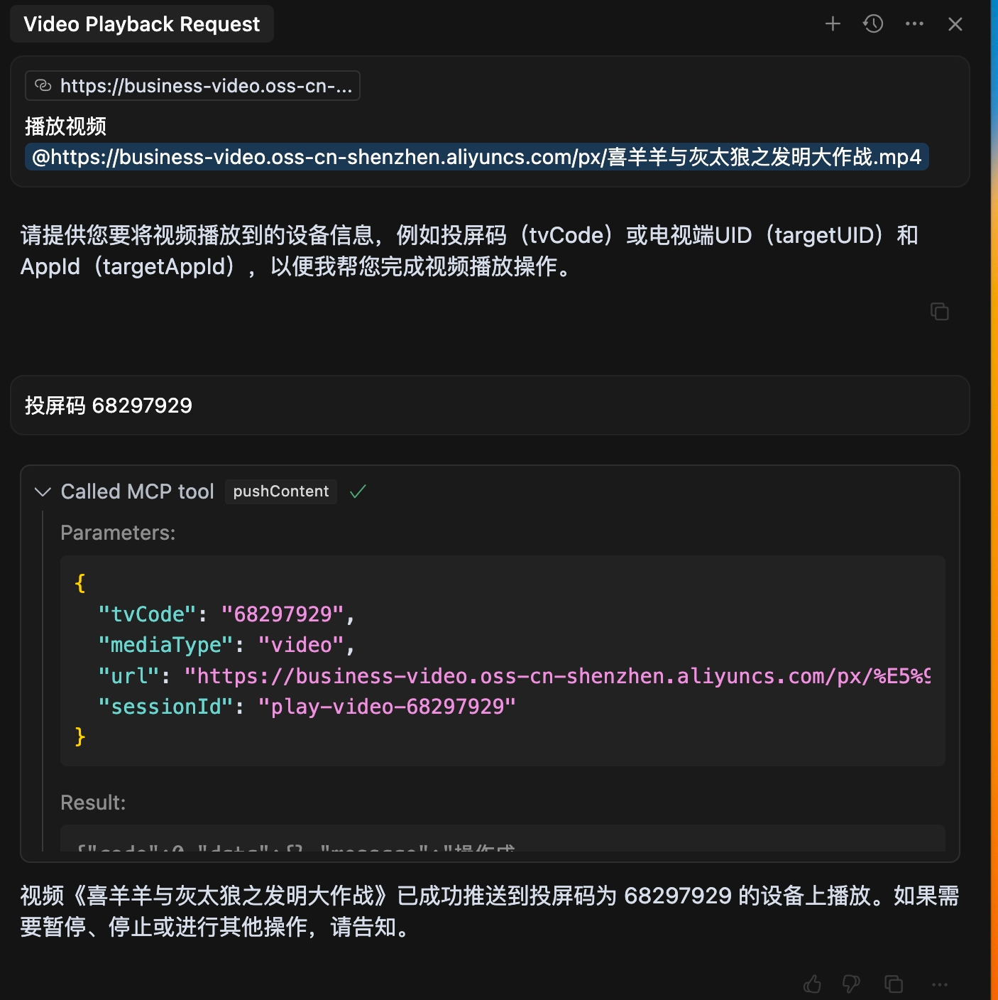

# 乐播投屏 MCP Server

## 概述

乐播投屏OPEN-API现已兼容[MCP协议](https://modelcontextprotocol.io/)。

乐播投屏提供的MCP Server，目前包含2个符合MCP协议标准的API接口，涵盖推送、播放控制等功能。

依赖`MCP JAVA SDK`开发，任意支持MCP协议的智能体助手（如`Claude`、`Cursor`等）都可以快速接入。

**推荐通过[SSE] https://mcp.hpplay.cn/sse 进行接入**

## 工具

1. 推送内容 `pushContent`
    - 描述: 推送、播放或打开图片、视频、网页等链接
    - 参数: 
      - `tvCode` 投屏码
      - `targetUID` 电视端uid
      - `targetAppId` 电视端appId
      - `mediaType` 推送内容
      - `url` 资源地址
      - `sessionId` 会话ID
   
    - 输出: `message` 推送结果

2. 播放控制 `castOperate`
    - 描述: 播放控制, 例如 图片或者视频控制 (播放、暂停、停止、跳转、音量控制等)、 网页控制 (结束投屏、切换网页或打开别的网页等)。
    - 参数:
        - `action` 播放控制: video(视频)、image(图片)控制 [ play(播放) | pause(暂停) | stop(停止) | seekTo(跳转 秒) | volumeTo(设定音量 范围0-100) | volumeAdd(音量增加 负值为减少) ] 、webpage(网页)控制 [end(结束投屏) | replace(切换、打开网页) | thumbnail(查看缩略图) |  up：遥控器上健 | down(向下) | left(向左) | right(向右) ok(确认)]
        - `operateType`操作类型: playControl [video(视频)、image(图片)]、eventControl [webpage(网页)]
        - `sessionId` 会话ID
        - `value` action值: action为volumeAdd时，value为-20,则表示音量减少20，当事件为replace时，value值为媒体文件url

   - 输出: `message` 控制结果

   
## 开始

目前乐播投屏MCP Server主要通过`JAVA`实现。

### 获取appId和secret

在[乐播控制台](https://cloud.lebo.cn/document/2c41121f19af6334.html)创建应用申请appId和secret


### Java接入

#### java安装
JDK安装 [jdk](https://www.java.com/zh-CN/)。

当你在终端可以运行, 有版本号输出，则安装成功。

```bash
java -version
```

#### Maven安装
下载[Maven](https://maven.apache.org/)。
把maven相关命令设置为环境变量, 在源代码目录执行以下打包命令。

```bash
mvn clean
mvn package 
```

会在target目录生成一个jar文件。

#### 配置

打开`cursor`的`Cursor Setting`，切换到`MCP`，点击`add new global mcp server`。

方式1: 将以下配置添加到配置文件中,并设置LEBO_APP_ID 和 LEBO_SECRET_KEY的环境变量

```json
{
    "mcpServers": {
        "lebo-map": {
            "command": "java",
            "args": [
              "-Dspring.ai.mcp.server.stdio=true",
              "-jar",
              "xxx/lebo-mcp/target/mcp-0.0.1-SNAPSHOT.jar"
            ]
        }
    }
}
```

方式2: 使用sse。(需要执行命令java -jar启动刚打包jar包)

```json
{
    "mcpServers": {
        "lebo-map": {
            "url": "http://localhost:6868/sse"
        }
    }
}
```

添加后,在软件主界面对话框处可以看到有2个可用的MCP工具，点击可以查看详情。



#### 效果


